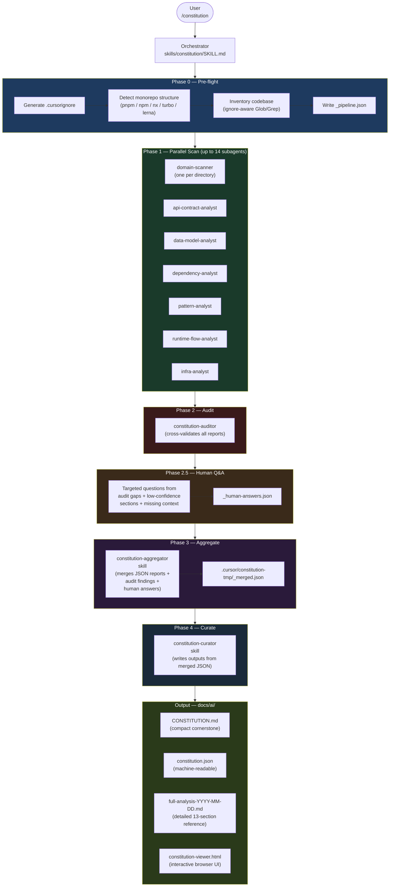

# Cursor Constitution Generator

A Cursor plugin that analyses a brownfield codebase and produces
`docs/ai/CONSTITUTION.md` — a compact cornerstone for downstream AI workflows —
backed by a detailed `docs/ai/full-analysis-YYYY-MM-DD.md` reference document.

The constitution grounds later stages:
- spec creation (`what` should change)
- design (`how` the change fits the current system)
- task composition
- development
- QA

It does not replace spec or design. It gives those stages a brownfield baseline
derived from the existing codebase.

---

## Installation

### Option A — Direct URL install (recommended)

Run this command in Cursor agent chat:

```
/add-plugin https://github.com/zlatkomq/legacy_ai_analyser
```

Then run the project setup step below.

### Option B — Cursor Marketplace

1. Open the Marketplace panel in Cursor
2. Search **constitution-generator**
3. Install (project-scoped or user-level)
4. Run the project setup step below

### Option C — Manual (non-plugin)

Use the `non-plugin` branch and `install.sh`:

```bash
git clone https://github.com/zlatkomq/legacy_ai_analyser.git
cd legacy_ai_analyser
git checkout non-plugin
cd /path/to/your/project
bash /path/to/legacy_ai_analyser/install.sh
```

---

## Project setup (both options)

After installing the plugin, run this one-time setup in your target project:

```bash
# Copy baseline .cursorignore (if you don't have one already)
cp /path/to/plugin/.cursorignore .cursorignore
```

Then open the project in Cursor and type in agent chat:

```
Generate a constitution for this codebase
```

---

## After installing

### Step 1 — Run the analysis

Open your legacy project in Cursor. In agent chat, run:

```
/constitution
```

This triggers the full analysis pipeline. The agent will:
1. Check and generate `.cursorignore` (excludes noise from analysis)
2. Scan the codebase with parallel specialist agents
3. Audit findings for consistency and confidence
4. Ask you targeted questions to fill gaps the analysis couldn't resolve (skippable)
5. Aggregate and curate the final outputs

### Step 2 — Review the output

Once complete, four files are written into your project:

- `docs/ai/CONSTITUTION.md` — the compact cornerstone (~600-800 words) for all downstream agents
- `docs/ai/constitution.json` — machine-readable constitution for downstream agent lookups
- `docs/ai/full-analysis-YYYY-MM-DD.md` — the detailed 13-section reference document
- `docs/ai/constitution-viewer.html` — interactive browser UI (see below)

#### The interactive viewer

Open `docs/ai/constitution-viewer.html` directly in any browser — no server needed, no dependencies.

It gives you:
- A searchable sidebar with all 13 constitution sections
- Colour-coded confidence badges per section (green / amber / red)
- HTTP method badges on endpoint tables
- Highlighted `[NEEDS REVIEW]` warnings
- Technical debt register with AI-risk levels
- Sensitive zones with human review flags
- DO / DO NOT rules in a split-column layout

This is the easiest way to review the full analysis before using the constitution as a downstream base. Share it with your team as a single HTML file.

Check sections marked `[NEEDS REVIEW]` — these are areas where the analysis found low confidence or contested claims. Human validation is needed before relying on them downstream.

### Step 3 — Use it in your workflow

**Primary use:** Use `CONSTITUTION.md` as **preamble / guardrails** in the prompt for
your downstream agents (spec, design, tasks, dev, QA). Paste it (or the relevant part)
into the system prompt or context so the AI respects the project’s constraints, patterns,
and DO/DO NOT rules.

- **Spec** — constitution in preamble so the AI understands current constraints before writing the spec
- **Design** — constitution in preamble so the AI respects architecture and patterns
- **Tasks / Dev / QA** — same: constitution as preamble so outputs stay within guardrails

Optional: for deep dives use `docs/ai/full-analysis-*.md`; for structured lookups use
`docs/ai/constitution.json`. See [docs/DOWNSTREAM-GUIDE.md](docs/DOWNSTREAM-GUIDE.md) for
full integration patterns when you need them.

### Keeping it up to date

| Situation | Command |
|-----------|---------|
| Code changed significantly | `/constitution` — full re-run |
| You found an error in the constitution | `/constitution-patch` — corrects a specific claim, survives re-runs |

---

## What's in the plugin

```
constitution-generator/
├── .cursor-plugin/
│   └── plugin.json                         ← Plugin manifest
├── agents/
│   ├── domain-scanner.md                   ← One instance per directory
│   ├── api-contract-analyst.md             ← Maps all API surfaces
│   ├── data-model-analyst.md               ← Schemas, entities, data flow
│   ├── dependency-analyst.md               ← Tech stack and package health
│   ├── pattern-analyst.md                  ← Architecture and coding patterns
│   ├── runtime-flow-analyst.md             ← Actual request/event call chains
│   ├── infra-analyst.md                    ← Infrastructure, CI/CD, deployment
│   └── constitution-auditor.md             ← Cross-validates all other agents
├── skills/
│   ├── constitution/SKILL.md               ← Master orchestrator (/constitution)
│   ├── constitution-aggregator/SKILL.md    ← Merges verified reports
│   ├── constitution-curator/SKILL.md       ← Writes CONSTITUTION.md + full analysis + JSON
│   └── constitution-patch/SKILL.md         ← Manual corrections (/constitution-patch)
├── docs/
│   └── DOWNSTREAM-GUIDE.md                 ← Integration patterns for downstream agents
├── rules/
│   └── constitution-mode.mdc               ← Pipeline discipline rules
├── .cursorignore                           ← Baseline exclusions template (copy to your project)
└── install.sh                              ← Manual install script (non-plugin branch)
```

---

## Requirements

- **Cursor 2.4+** required (parallel subagent support)
- An existing codebase to analyse
- Monorepo/workspace projects supported (pnpm, npm, nx, turbo, lerna)

---

## What it produces (in your project)

- `docs/ai/CONSTITUTION.md` — compact cornerstone (~600-800 words) with DO/DO NOT rules,
  tech stack, patterns, naming, and testing rules for all downstream agents.
  Fixed 10-section structure that downstream agents can depend on.
- `docs/ai/constitution.json` — machine-readable constitution for structured lookups
  (ORM, auth strategy, DO/DO NOT rules, tech stack, etc.)
- `docs/ai/full-analysis-YYYY-MM-DD.md` — full 13-section analysis with section-level
  confidence, evidence sources, and downstream-use guidance
- `docs/ai/constitution-viewer.html` — self-contained interactive browser UI of the full analysis

---

## Pipeline



- Manual corrections: `/constitution-patch` — corrections persist across re-runs
- Monorepo scaling: wave execution for large workspaces

Estimated time: 10–25 min depending on codebase size.

---

## Branches

| Branch | Purpose |
|--------|---------|
| `main` | Cursor plugin format — install via Cursor Marketplace or `/add-plugin` |
| `non-plugin` | Legacy `install.sh` format — copy files directly into your project |
